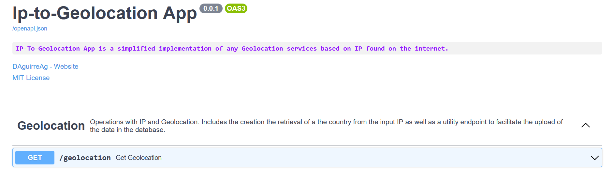

# IP-to-Geolocation

The following repository contains code as a proof of concept of a IP-to-Geolocation web application. The main task of the application is to return the geographic location of a given IP address.

## 1. Introduction

Some services require knowing the location of the users for providing location dependent services.

This repository aims at implementing a web service for users to identify where a given IP is coming from.

	

		
	  	
	

	

	  <i>Overview of frontend and database.</i>
	

## 2. How to use it
Follow the next steps:

* Prepare the database:
	  * Open your favourite SQL database and create the database and the table using `setup.sql` helper script.
	  * Open the `config.py` file and modify the `SQLALCHEMY_DATABASE_URL` to use the database you just created.

* Prepare the backend service:
	  * Install the required python packages via `pip install -r requirements.txt`. (It is recommended to use virtual environments when installing them to avoid conflicting version issues).
	  * Open a terminal window and type `uvicorn main:app --reload` to launch the application.
	  * (Optional) Open a browser and type `http://127.0.0.1:8000/docs` in the address bar to open an interactive view of the backend service.

	

		
	

	

	  <i>Running the backend service.</i>
	

* Prepare the frontend:
	  * Run the `index.html` in a live server and open the provided URL. (I recommend using VScode's Live server plug-in due to its ease of use)

	

		
	

	

	  <i>Running the frontend.</i>
	

* Upload data:
    * Download the `geolite2-country-ipv4.csv` file from [here](https://github.com/sapics/ip-location-db).
    * Open a browser and type `http://127.0.0.1:8000/docs` in the address bar to open an interactive view of the backend service.
    * Press the `Try out` option, select the downloaded file and press `XXXXX` to upload the file.

	

		
	

	

	  <i>Running the frontend.</i>
	

## 3. Technical details

### 3.1. Back-of-the-envelope calculations

Find below a rough estimation of database requirements.

Assumptions:
* Amount of IP ranges: 240k
* Hold histrical records: No

Database size:
* Record size: 2*64 (BIGINT) + 13 (TIMESTAMP) + 4 (VARCHAR) = 145 bytes 
* Required database size: 145 * 240k = 34 Mb

### 3.2. Technology stack

* Vanilla JS and JQuery were selected due to the simple nature of the application.
* FastAPI was selected due to its performance and great community adoption.
* SQL was selected due the robustness of it and the structured nature of the data to be received.

### 3.3. How it works

The architecture of the code works in the following way:

* A HTML form allows the user to input his feedback and submit it via JQuery to the server.
* The server running the backend (implemented in FastAPI) will receive the form data and, if correct, it will add it to the database.

Note that a microservice architecture philosophy was followed, as this should allow the application to receive feedback from users even when the other services are down (as long as they are not located in the same machines).

	

		
	

	

	  <i>Overview of frontend and database.</i>
	

### 3.4. Endpoints
The application structure is pretty simple. It is composed of two API endpoints. 
* `/geolocation`: It expects an IP address as an input and outputs the country from which the given IP originated from.
* `/new_geolocation_data`: It is a utility function to facilitate the refresh and upload of the database table that contains the mapping from IP ranges to countries. (Note that in production environments, this endpoint should be only accessible to authorized users, as it allows to upload any data in the database).

   
  <i>Endpoints.</i>

## 3. Future functionalities/Considerations
As a proof of concept of a IP-to-Geolocation application, the source code doesn't implement all the functionalities that this kind of applications should have. On one hand, only the country of origin is being retrieved (no province or cities are being provided). On the other hand, the data in the database is expected to be manually uploaded, which can be time consuming as well as introduce human errors in the process. Also, this operation is not done in the background, which causes a blocking issue (although it is not a big deal with such a small dataset). It should also be noted that the data upload endpoint is directly exposed via the API service. This steps should be moved to an independent service, to avoid unwanted uploads to the database.

Find below a list of functionalities that will need to be considered implementing in the current repository to make it fully functional as well as some nice-to-have functionalities: 

* Province and city data should be added to the database to make the queries more complete and useful.
* One of the endpoints is used to upload CSV data into the Database. In production settings, these endpoint should only be accessible to authorized people, to avoid people uploading erroneous data.
* Upload file's content should be sanitized to ensure no malicious code is placed in the database.
* For this small size database, it should be possible to implement a in-memory database, to speed up the queries. 
* It should be possible to implement a date dependant search option, to know from where a given IP come from in a given moment in time.

## 4. Disclaimers
This is a proof of concept project that aims to shown how a IP-to-Geolocation service works. Bear in mind, that as many POC, it is not a final product and many points need to be considered before making the code production ready.

## References
* [Internet geolocation](https://en.wikipedia.org/wiki/Internet_geolocation)
* [IP-to-Geolocation Data](https://github.com/sapics/ip-location-db)
